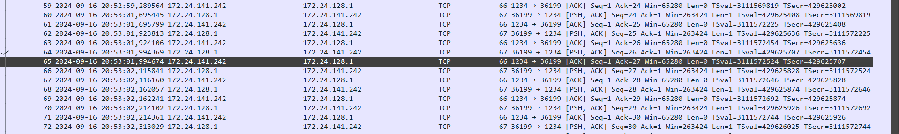
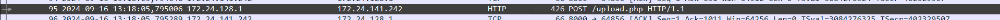
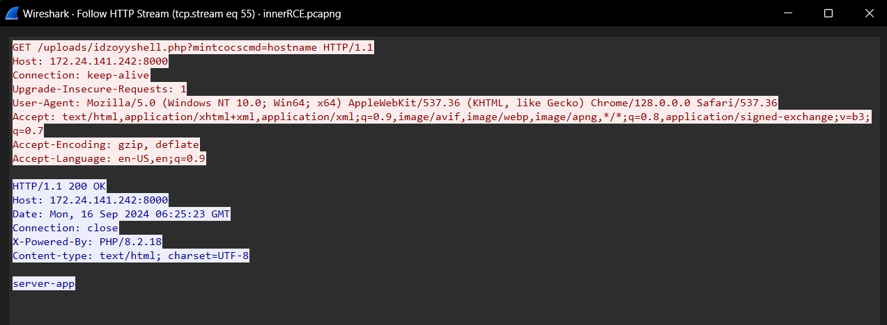

# Jarkom-Modul-1-IT21-2024

|Nama  | NRP |
|--|--|
| Nathan Kho Pancras | 5027221002 |
| Muhammad Andrean Rizq Prasetio | 5027221052 |

## Challenges

- [Jarkom-Modul-1-IT21-2024](#jarkom-modul-1-it21-2024)
  - [Challenges](#challenges)
    - [Advance Sanity Check](#advance-sanity-check)
    - [Illegal Breakthrough](#illegal-breakthrough)
    - [Packets Barrage](#packets-barrage)
    - [FTP Login](#ftp-login)
    - [Surprise](#surprise)
    - [Corporate Breach](#corporate-breach)
    - [Malicious Code](#malicious-code)
    - [Pegawai Negeri Sebelah](#pegawai-negeri-sebelah)
    - [EZ](#ez)
    - [Rizzset](#rizzset)
    - [Gajah Terbang (Server Recon)](#gajah-terbang-server-recon)
    - [Gajah Terbang (Attacker Recon)](#gajah-terbang-attacker-recon)
    - [Stegography](#stegography)
    - [innerRCE](#innerrce)
    - [Baby Hengker](#baby-hengker)
    - [Adult Hengker](#adult-hengker)

### Advance Sanity Check

Yang sederhana dulu aja. (file: sanity.pcapng)

**Q1** - Apa username pengirim?

Follow > TCP Stream > eq 3

**Q2** - Apa nama file yang dikirim?

tcp.stream.eq 4

**Q3** - Ikuti petunjuk untuk mendapatkan pesan rahasia

Peraturan Soal Shift > cGVud29yZA== > penword

**`JarkomIT{8uK4n_S4n1ty_b1a5A_vtvGNBv8TummwrvZPtLD4XFJTSu5BpwjTk21DruKc4us7bO67NBvgIKK}`**

### Illegal Breakthrough

Seorang full-stack developer bernama kevin sedang membuat sebuah web yang memiliki login page. Tetapi karena ia hanya digaji rendah, ia lupa untuk mengamankan web yang ia buat. Bantulah kevin untuk tracing dari jejak yang ditinggalkan oleh attacker. (file: break.pcapng)

**Q1** - Apa IP address dari korban?

Korban = destination : 172.21.88.207

**Q2** - Apa port yang digunakan sebagai webserver?

1917

**Q3** - Dimana endpoint yang terdapat login?

/ww1.php

**Q4** - Tools apa yang digunakan oleh attacker?

Fuzz Faster U Fool v2.1.0-dev -> package name: ffuf-v2.1.0-dev

**Q5** - Apa kredensial yang berhasil digunakan oleh attacker untuk login?

Follow > HTTP Stream > eq 1917

**`JarkomIT{d34th_fr0m_th3_sky_yvEQH6jxmPAqZRbqNI0ooaGhEH1sScGTtiMPWm6vWuesQ6C74PZwWW1}`**

### Packets Barrage

Setelah membantu kevin untuk tracing attacker, sekarang bantu lagi kevin untuk mencari apa yang dilakukan oleh attacker.
File sama seperti Illegal Breakthrough.

**Q1** - Apa IP address dari attacker?

Attacker = source : 172.21.80.1

**Q2** - Berapa total attempt dari bruteforce attacker?

Dikarenakan sudah menemukan un/pw di tcp.stream eq 1917, dan semua packet di HTTP stream: POST ke /ww1.php maka total attempt = 1917

**Q3** - Apa nama file yang didownload oleh attacker setelah berhasil login?

tcp.stream eq 1918 > Albatros.txt

**Q4** - Apa isi dari file yang disisipkan oleh attacker?

Der Rote Kampfflieger

**`JarkomIT{th3_fly1ng_c1rcus_0f_w4r_2VpANzt61cHPI1bVJFbehI7a65StGbt2VsQwE2gMiKLkrxQEvtfL2ACE}`**

### FTP Login

Seseorang menemukan sebuah celah dalam sebuah server. Ia mencoba untuk melakukan brute force login dan ia berhasil masuk. Lakukan pemeriksaan untuk melihat apa yang dilakukan oleh orang tersebut! (file: ftplogin.pcapng)

**Q1** - Apa username yang berhasil digunakan untuk FTP login?

Follow > TCP Stream > eq 4

sn34ky

**Q2** - Apa password yang berhasil digunakan untuk FTP login?

sup3rsn1ff3r

**`JarkomIT{n0t_s0_s3cur3_ftp_QiwZwrCuLIqeCgm2PYNkxq2yYL0pILQ2ea8vGo7ZMeytj8AS19zBG1N}`**

### Surprise

Setelah mengetahui apa yang diketahui pada challenge sebelumnya, sekarang lakukan analisis untuk mengetahui apa yang sebenarnya terjadi.
File sama seperti FTP Login.

**Q1** - Apa service yang digunakan pada FTP server?

vsFTPd 3.0.3

**Q2** - Apa nama file yang dikirim oleh attacker?

g0tcha.cpp

**Q3** - Apa pesan rahasia yang ditinggalkan oleh attacker?

tcp.stream eq 5

**`JarkomIT{l1ttl3_m0us3_1n_th3_h0us3_Q4Gsd9Dka8kHhR1BIqr0fe0eFG0oC23HMxO8A39m23IOLugHZhRsTCHU}`**

### Corporate Breach

Sebuah perusahaan IT support mendapatkan serangan oleh orang tidak dikenal. Bantulah perusahaan tersebut untuk melacak jejak yang ditinggalkan oleh attacker. (file: breach.pcapng)

**Q1** - Siapa nama attacker?

**Q2** - Apa email yang digunakan untuk login?

**Q3** - Apa password yang digunakan untuk login?

**`JarkomIT{supp0rt_k0k_l3m4h_bg_AKiL8iVClB4xesDqZ9yVlv7aSG6xcrHXL3PpyU60h6hcz7GEbFOOG6}`**

### Malicious Code

Ternyata sang attacker dengan sengaja meninggalkan sesuatu untuk dibaca oleh kamu. Lihat pesan apa yang ditinggalkan attacker.
File sama seperti Corporate Breach.

**Q1** - Berapa total attempt attacker melakukan dir listing?

54 - 2 = 52

**Q2** - Apa endpoint yang berhasil attacker dapatkan untuk login page?

/index.php - Q2/3 Corporate Breach

**Q3** - Pada attempt ke berapa attacker menemukan email dan password yang benar?

207 - 54 = 153

**Q4** - Apa jawaban dari pertanyaan sang attacker?

dengan bruteforce :skull:, jawabannya merah 👍

**`JarkomIT{s3cr3t_m3ss4ge_fr0m_4uth0r_tDbBOhowylLVR8zwIXddLc2BvC0JJPFkJiPW13SMhNQGtb9s6lFUL0R}`**

### Pegawai Negeri Sebelah

Kamu seorang data analisis diminta untuk memastikan ulang data-data dari beberapa pegawai (file: rahasia.pcap)

**Q1** - Siapa yang memiliki password nNnM%coQuF?

`Follow > TCP Stream > eq 1`

Vero Tampubolon

**Q2** - Apa jabatan dari Taufan Kuswandari?

Analis Kebijakan

**Q3** - Siapa yang paling awal di list?

Apa password paling akhir dari list?

**Q4** - Apa password paling akhir dari list?

RyxaJPv^yF

**`JarkomIT{Tum8eN_p45SnYa_Ku4t_B1aS4Nya_giY74xwNm6AkeQsd3EuzskQxJL3u9Wc1Y6xDRTlEPwgSKVxJj0DNM4h}`**

### EZ

Aku sedang mencoba bikin chat service tapi kayanya pesannya bisa di sniffing deh? coba temukan pesannya. (file: ez.pcapng)

**Q1** - Temukan jawaban dari log tersebut?

`Follow > TCP Stream > eq 0`

jawabannya jawaban

**Q2** - Port berapa yang digunakan service tersebut

1234

**`JarkomIT{BiAr_aman_Pake_sSh_gHq95NMVuHOmejn3i4agOZ8033z1RLSbai2yR3bz1UNOI5n4oyjwEZ}`**

### Rizzset

Aku sedang bereksperimen dengan suatu tools, kamu juga bisa menggunakannya untuk menjawab soal ini (file: riset.pcapng)

**Q1** - Apa nama domain dari dns query pada log?
Format: www.domain.com

www.its.ac.id

**Q2** - berapa IP dari domain tersebut?
Format: xxx.xxx.xxx.xxx

103.94.189.5

**Q3** - Tuliskan JARM Fingerprint yang dihasilkan dari domain tersebut
Format: string
ex. abcdef0123456789abcdef0123456789abcdef0123456789abcdef01234567

2ad2ad16d2ad2ad22c2ad2ad2ad2ad74aaecca9f9c4a3303863dfee62b241e

**`JarkomIT{Dn5_C0rR34t10n_hRrG3FhD1kdyBkXNhze8aU4gsr1zZBZvm8Loa5k0FAw6iweWxvCRfc1T5}
`**

(Note: JARM Fingerprint didapat dari program JARM)

### Gajah Terbang (Server Recon)

Pada perusahaan PT. +1000 Aura telah terjadi insiden yang besar, dimana seorang hengker berhasil masuk ke sistem database perusahaan tersebut, dan melakukan manipulasi sistem database mereka. Anda sebagai profesional Cyber Security Analyst ditugaskan untuk melakukan investigasi melalui log network yang berhasil tercapture! (file: gajahterbang.pcapng)

**Q1** - Apa DBMS yang digunakan pada server tersebut?

PostgreSQL

**Q2** - Di port berapa DBMS server tersebut berjalan?

6969

**Q3** - OS apa yang digunakan untuk server tersebut?

Debian

**Q4** - Apa credentials username DBMS valid yang digunakan?

s1gm4

**Q5** - Apa nama database yang digunakan?

sigmaskibidigyatrizzzz

**Q6** - Ada berapa banyak users dalam database tersebut?

4

**Q7** - Apa email yang digunakan oleh admin?

jojohermawan@gmail.com

**Q8** - Apa password yang digunakan oleh admin?

admin1234

**`JarkomIT{Gy4tT_M5g_4U_aR1RFyN6tIHcNcU22a6cu1gT85k1Zs3PIxBDC2qfpzNu91BQ3e9DLBiD1}`**

### Gajah Terbang (Attacker Recon)

Setelah berhasil menginvestigasi server yang berjalan, kamu diharuskan untuk mencari identitas dan mencari jejak apa saja yang telah dilakukan oleh penyerang! Kamu jago, pasti bisa let’s go temukan tersangkanya!!!
File sama seperti Gajah Terbang. (gajahterbang.pcapng)

**Q1** - Akun apa yang dimiliki oleh penyerang dalam database tersebut, berikan emailnya!
Format: user@gmail.com

kuntoajiisrillll@gmail.com

**Q2** - Apa password yang digunakan oleh penyerang?
format: string

kissme

**Q3** - Pada tanggal berapa akun penyerang diban?
Format:  YYYY-MM-DD
ex. 1945-08-17

2024-06-09

**Q4** - Table apa saja yang dimodifikasi oleh penyerang?
Format: string dan string

users dan banned_users

**Q5** - Barang apa saja yang telah dibeli oleh penyerang?
Format: string dan string

rokok dan es krim

**Q6** - Berapa total transaksi dari barang yang dibeli oleh penyerang?
Format: number

24500

**`JarkomIT{G4jaH_K0k_t3RbaNG_QaAPkJ1nHxvYZtIlvOqjBBFgeYnt9J4jfQwtlNxV48dURuvrUiVVhKt5}`**

### Stegography

Seekor stegosaurus berusaha menyimpan pesan di dalam beberapa gambar apakah kamu bisa memperoleh dan menyusunnya? (14.pcapng)

**Q1** - Ada berapa banyak gambar yang dikirim?
Format: number

13

**Q2** - Nama-nama file yang memiliki pesan? (Berurut abjad)
Format: NAMEFILE, NAMEFILE ex. CALCULUS, FISIKA

ATP, EH, KJK

**Q3** - Apa pesannya jika digabung?
Format: string ex. meteor jatuh

pahlawan keamanan siber

**`JarkomIT{S3LaM4t_p4rA_PahL4WaN_hYro38fcyVKdjZRAIB7hrBLXCP5stN1qRRpbigqSKnb5Q8JMTs81chC5}`**

### innerRCE

omg, SIEM mendeteksi adanya serangan hacker yang berhasil mengupload webshell. sebagai analyst yang jago, kamu diharuskan membuat laporan insiden tersebut (file: innerRCE.pcapng)

**Q1** - Kapan hacker berhasil mengupload webshell?

**Q2** - Endpoint url dan server mana yang rentan sehingga dapat dihack oleh hacker?

**Q3** - Nama webshell yang diupload oleh hacker?

idzoyyshell.php

**Q4** - Command pertama yang berhasil dieksekusi oleh hacker?

**Q5** - Berdasarkan log, hacker tersebut mencoba menuliskan pesan, apa pesan yang hacker coba tuliskan?

**`JarkomIT{P4L1nG_g4mPaNg_An4L1sA_W3b_aTk_rn0sH5eR0FRGxn1A7SzDMji3aW4iijlizbL51BC4mVl4dfsCOs0cvRCE}`**

### Baby Hengker

Pada suatu hari, ada seorang mahasiswa yang menyusup kedalam lab. mahasiswa tersebut menyalakan salah satu komputer yang ada dan mulai mengetikkan sesuatu?!?!?! bantulah mas aji menganalisa apa yang dilakukan oleh mahasiswa tersebut. (file: innerchild.pcap)

**Q1** - Kapan hacker tersebut mengakses komputer yang ada di lab?

2024-09-16 13:43

**Q2** - Apa yang dituliskan oleh hacker tersebut?

Berdasarkan .pcap ini, ini adalah chall device USB yang bisa dicari perlakuannya menurut HID Data. Setelah beberapa lama, script untuk parse USB ke keystroke ditemukan [disini](https://github.com/5h4rrK/CTF-Usb_Keyboard_Parser/tree/main). Kemudian kita hanya perlu untuk memasukkan .pcap kita ke script, dan hasil keystroke akan keluar.

Kita bisa menghapus huruf yang double (ex. ppassword) dan kalimat akhir menjadi:

`ini password wifinya apa ya?`

(Note: Dikarenakan kesalahan sistem, jawaban asli adalah ini passwordnya apa ya? yang dikonfirmasi melalui asisten)

**`JarkomIT{4ku_p9n_j4d1_h3n9k3r_CeKrWLt4hzM8aVjSVsajYxumRAm14wHzwuSw44Yqe9oXg18QcBJDWHCK}`**

### Adult Hengker

Setelah sang mahasiswa tau passwordnya, dia akhirnya bisa masuk ke komputer dan menuliskan sesuatu di ms paint, apakah kamu tau dia menulis apa? (file: innerchild2.pcap)

**Q1** - Apakah device yang digunakan oleh seorang mahasiswa tersebut?

**Q2** - Apakah device yang digunakan oleh seorang mahasiswa tersebut? (seharusnya kesalahan sistem)
 
Format: STRING .ex AKU INGIN JADI SEORANG BATMAN

Berdasarkan .pcap ini, ini juga chall USB device melalui HID Data. Setelah proses pencarian, ditemukan tool untuk melakukan visualisasi terdapat file .pcap yang berisi HID Data mouse [disini](https://github.com/WangYihang/USB-Mouse-Pcap-Visualizer).

HALO MAS KEVIN SALKEN

**`JarkomIT{d0n7_wr173_r4nd0m1y_o2NdqrjFJ3cgfmfbLoMZCdgSFm45bUwqjbJwipMTt0KurYseN570EK3v1n}`**
